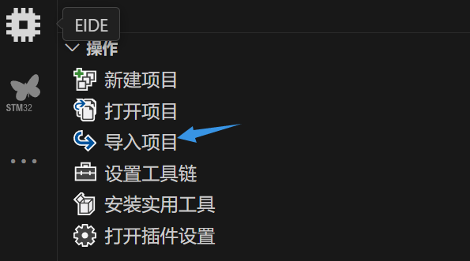

git工具的常用使用技巧，请参考：[Ethylene9160/Contacts: Contacts (github.com)](https://github.com/Ethylene9160/Contacts)。

# C98标准和注意事项

## 变量的声明和使用

在函数体内，所有变量需要**先声明，再使用**。例如：

```c
void function(){
    int i;
    //...
    for(i = 0; i < 100; ++i){
        /...
    }
}
```

以下做法是<font color = 'red'>错误</font>的示范：

```c
void function(){
    //...
    for(int i = 0; i < 100; ++i){
        \\编译器会发出报错。
    }
}
```

## 数组的传递

数组在传递到某个函数中的时候，请**同时传递数组的大小**。C语言不支持在另一个空间获取该指针占领的空间的大小，因为它传递的是指针的值的一个拷贝。

例如：

```c
void innerFunction(int*arr, int size);

void outerFunction(){
    int arr[] = {1,2,3,4};
    //使用sizeof获取数组空间大小和单个元素的空间大小。如果长度已知，也可以直接传递函数的长度。
    innerFunction(arr, sizeof(arr)/sizeof(int));
}
```


# 自定义变量、函数命名

本项目中，若不涉及专有名词缩写，变量命名可参考遵循：

* **局部变量名**

局部变量名采用<font color = 'blue'>全小写下划线</font>命名法。

```c
void function(){
    int time_counter;
    //...
}
```

注意，函数的参数一般当作局部变量。例如：

```c
void function(int first_param);
```

* **全局变量名、结构体成员变量名**

采用小驼峰命名法。例如：

```c
struct MyStruct{
    int structFeature;//成员变量
}
int timeCounter;//全局变量
```


* **函数命名**

采用<font color='blue'>小驼峰</font>命名。例如：

```c
function myFunction(){
    //...
}
```

* **结构体命名**

采用大驼峰命名。例如：

```c
struct MyStruct{
    //...
}
```

# 在VSCode中对keil工程进行接管

首先，请确保您已经有了`gcc`,`g++`,`make`的环境，并拥有了`arm-none-eabi-gcc`环境。如果没有配置，请参考：[IntelligentAGV/doc/visual_studio_code_guilder/使用VSCode进行stm32的编译和烧录.md at main · Ethylene9160/IntelligentAGV (github.com)](https://github.com/Ethylene9160/IntelligentAGV/blob/main/doc/visual_studio_code_guilder/使用VSCode进行stm32的编译和烧录.md)。

除此，本教程默认您拥有可以正常使用的keil MDK，版本在5及以上。

确认完毕后，请进行如下操作。

* 确认和配置AC5（第五代ArmCC）编译组件

如果您不确定您是否安装AC5编译器，请打开keil并**按照顺序**点击：


可以查看您的`ArmCC`编译器版本。请留意您是否有`v5.x`版本的编译器。例如，上图存在`v5.06update7(build 960)`的AC5编译器。如果您已拥有该环境，您可跳过AC5的安装步骤，但**仍需要在VSCode中进行配置。**

> 安装AC5：
>
> 进入[Documentation – Arm Developer](https://developer.arm.com/documentation/ka005184/latest)，选择你喜欢的Arm Compiler 5.xx版本进行下载。
>
> 然后，请找到您的**Keil软件**（UV4.exe）所在的文件夹，进入`ARM`文件夹，并新建一个文件夹用于保存您的AC5编译器。该文件夹名字通常可采用`ARM_Compiler_5.xx`来表示，你也可以取一个你喜欢的名字，但是不要包含中文字符。请记住这个地址。
>
> 然后，请安装您所下载的Arm Compiler，**请将安装位置选择在您刚刚创建的文件夹**，并安装。
>
> 安装完成后，按照同样的方式来到这个窗口，点击`Add another ARM Compiler Version to List..`, 选中您刚才使用的文件夹并确认。若出现新的第五版本的编译器，则说明配置成功。
>
> 
>
> 

找到并记录您的AC5编译根目录地址（例如上图中的`ARM_Compiler_5.06u7`。

* 安装STLINK套件

进入[STSW-LINK004 - STM32 ST-LINK utility - STMicroelectronics](https://www.st.com/en/development-tools/stsw-link004.html#get-software)网站，选择适合您系统版本的STLINK套件，解压后安装。请**牢记您的安装位置**。这将在之后起到重要的作用。

* 安装Embedded IDE插件

在Visual Studio Code的`extension`中，搜索插件`Embedded IDE`然后安装。


安装后，请进入扩展设置页面，找到（或搜索）STLink：


将其地址设置为您安装STLink的目录下的`ST-LINK_CLK.exe`的地址。注意，安装STLink包后，这个可执行文件会在`ST-LINK Utility`目录下。注意，是在你的安装目录下的`ST-LINK Utility`目录下。

同样在扩展界面中找到（或搜索）ARMCC5安装位置配置，将刚才记录的AC5编译目录地址复制进去。（当然，该插件也有对ARMCC6的配置。本项目仅需要ArmCC5，但您若感兴趣，也可用相似的办法配置ArmCC6编译环境）


最后，将您的keil软件（UV4.exe）的安装位置配置进入：


祝贺你。最重要的环节结束了。

* 安装Keil Assistant插件

搜索`Keil Assistant`插件并安装即可。

祝贺你。在这之后，您便能够通过VSCode对该代码进行编撰和烧录了。

## 使用

### 打开工程

* 初次接管-导入项目

进入插件EIDE选择`导入项目`。需要注意的是，导入目录时，请选择**MDK**选项。



* 再次编写-打开项目

进入EIDE插件，选择`打开项目`，找到您要打开的文件目录。EIDE的文件拓展名通常为`.code-workspace`。

**注意**： github中`UnderROS`下的`ROSInterface`已经完成了导入，直接在EIDE中选择`打开项目`即可。保留keil项目环境`ROSInterface.uvoptx`和`ROSInterface.uvoprojx`在里面的原因是(亲测删除后也能正常编译和烧录)，由于初次使用vscode，可能出现一些不容易理解的bug，若出现该情况，请切换回keil中进行编译测试。

### 编译和烧录工程

* 编译

编译按钮：


* 烧录

烧录需要进行些微配置。


在EIDE插件下，找到`烧录配置`，确保其为`STLink`。然后就能通过下载器下载啦

# Appendix

## ST-Link2下载线的连接：

|        | ST-Link v2下载器 | stm32f407vet6 |
| ------ | ---------------- | ------------- |
| 时钟   | SWCLK            | PA14          |
| I/O    | SWDIO            | PA13          |
| 地线   | GND              | G(GND)        |
| 电源线 | 3.3V             | 3.3V          |

## 编码设置

在导入这个项目时，由于使用了GBK编码，中文出现了乱码。

在VSCode中，进入设置(settings)界面：


在搜索框中输入`encoding`


将画蓝色框中的编码格式从`UTF-8`更改为`GBK`即可完成编码格式转换。


注意，这将转换的是vscode的**全局编码格式**。可能导致访问其它UTF-8编码格式的中文字符出现乱码。届时请将其更换回UTF-8格式。

若仅希望对当前文件编码格式进行修改，请点击：


将其从UTF-8改为GBK即可。
